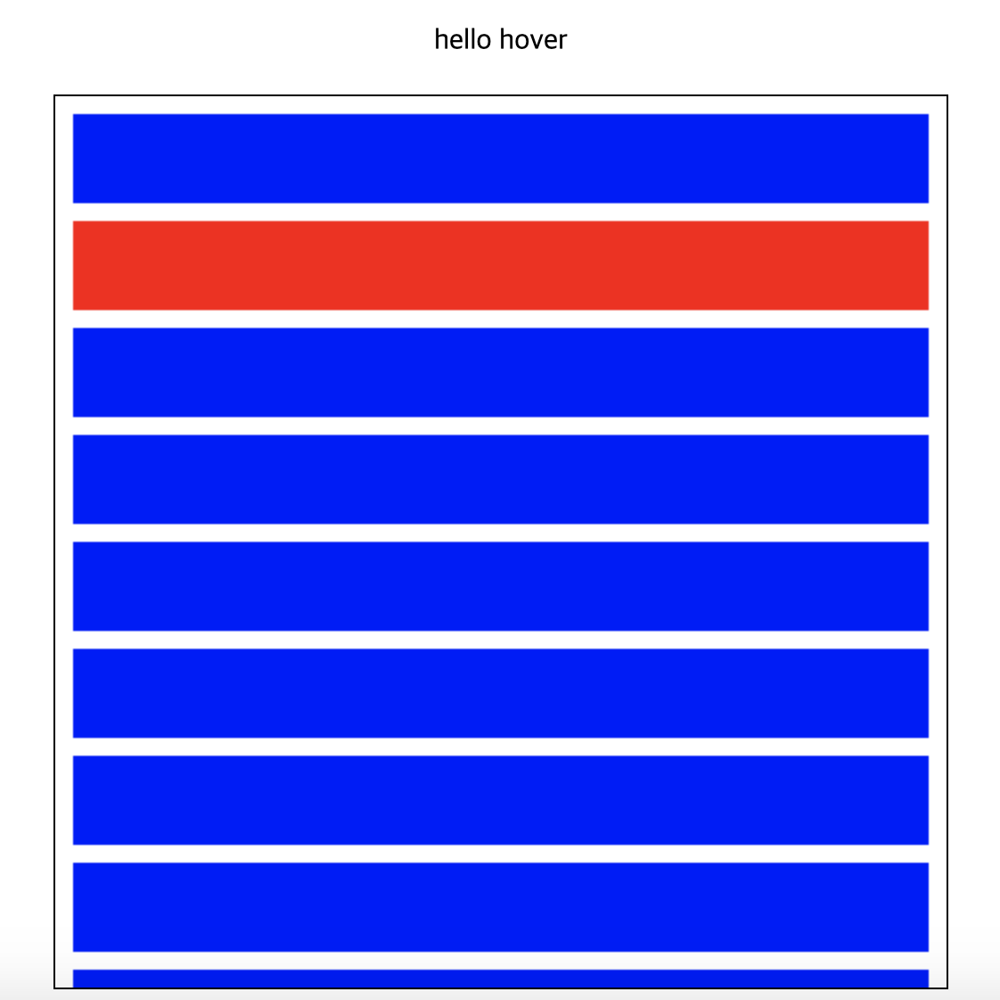
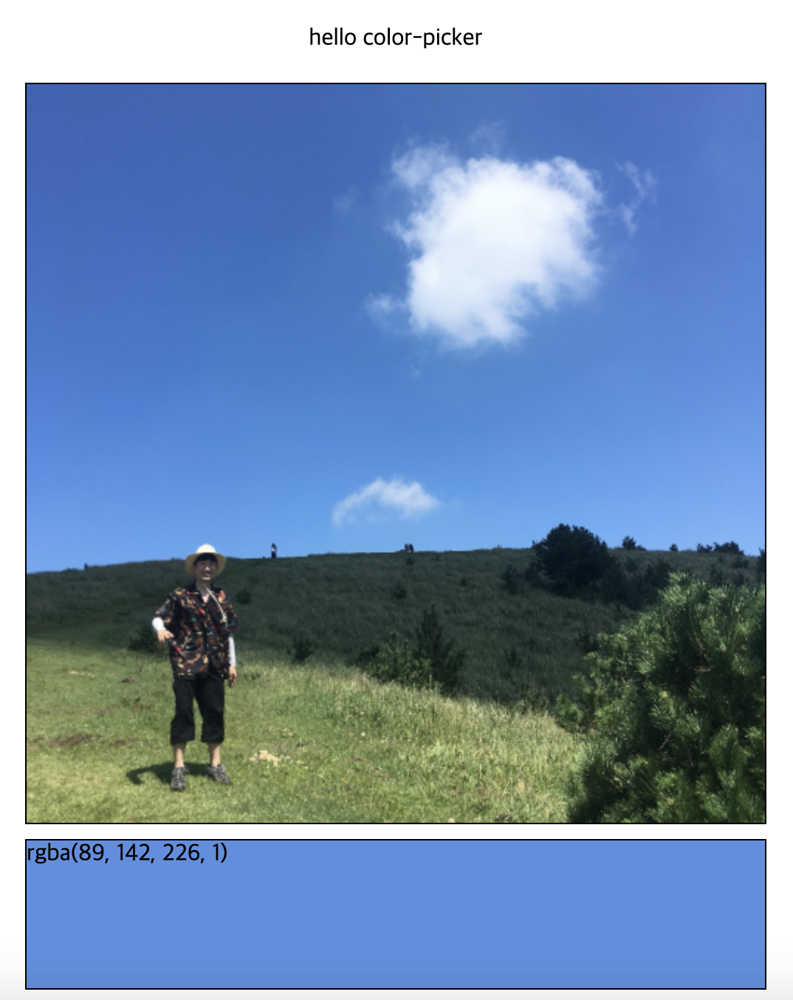
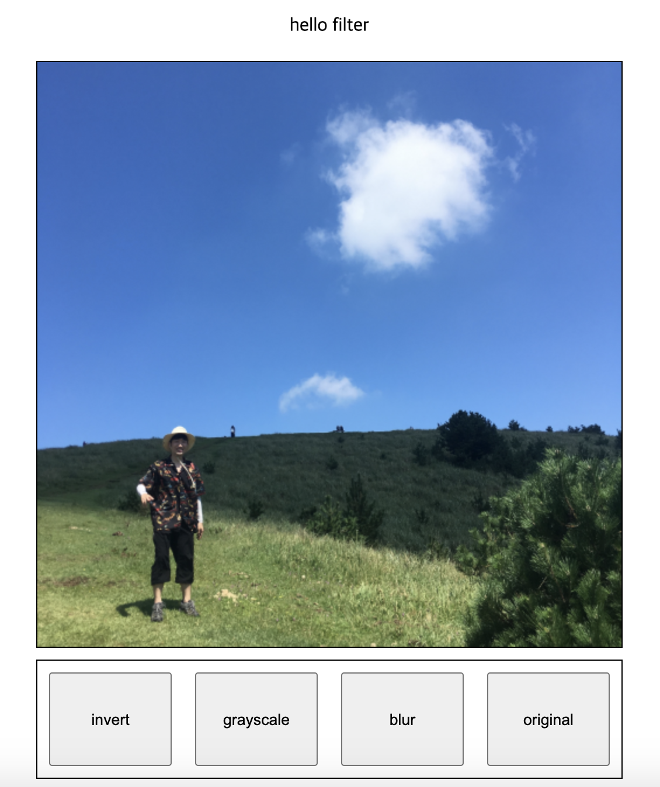
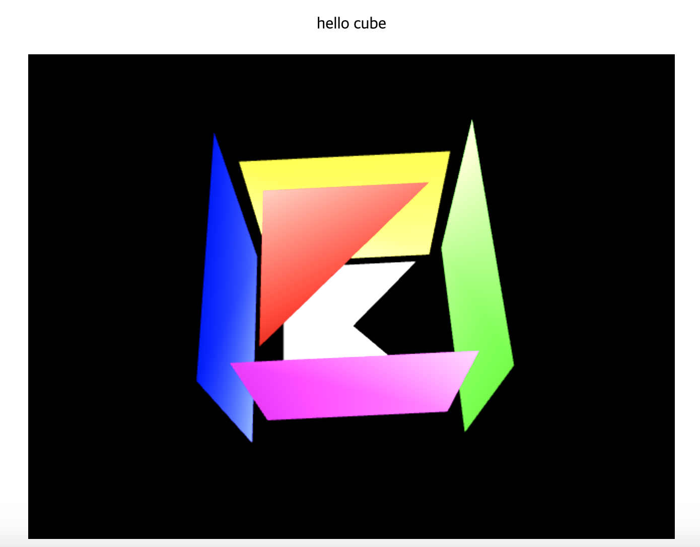
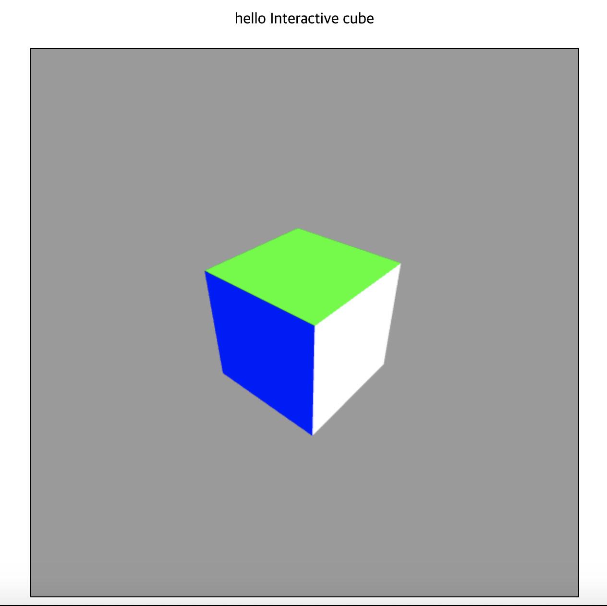

# Hello Canvas

연습목표기간 : 6/7 - 6/10 (4일)

## Memo

- vsCode Prettier 속성을 바꿔줘야겠다. vertices array들이 일렬로 저장되니 가독성이 매우 떨어짐. ✅
> 배열 column단위로 잘라주는 속성이 없는 듯하다..! 그래서 2차원이상 배열들은 // prettier-ignore를 붙여주었다.

## Details

- canvas 렌더링연습 ✅
- webgl 렌더링연습 ✅
- 영상처리(filter, pixelation) ✅
- 2D 애니메이션 ✅
- 3D 애니메이션 ✅
- 2D 인터랙션 ✅
- 3D 인터랙션

## Condition

- Library, Dependency x
- 최대한 모듈화 (재사용성)

## Solar System

## Hover

## Color Picker

이미지 CORS 문제 해결

1. `File://` -> `server.js`
2. `crossOrigin : "Anonymous"`

## Filter

1. 전체 캔버스 filtering ✅
2. 선택적 부분 filtering

## Cube Rotation

1. vertices + drawing + animation
2. color
3. OpenGL 참고

## Interactive Cube

1. [Matrix math for the web | MDN](https://developer.mozilla.org/en-US/docs/Web/API/WebGL_API/Matrix_math_for_the_web)
2. Mouse이벤트 + 좌표계산 -> rotate() -> animate()
